
Graphivz的几个使用示例

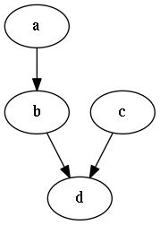

修改节点的颜色

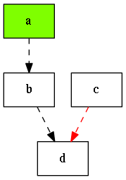

以图片为节点

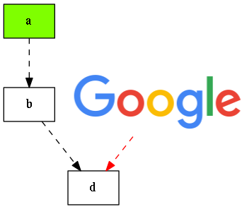

&ensp;&ensp;设置节点为图片的时候， `shape` 必须设置为 `none`

子图的绘制

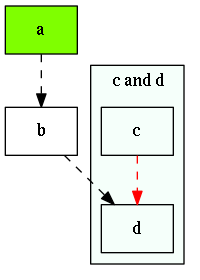

&ensp;&ensp; 子图的名称必须设置为 `cluster` 开头,否则 `graphviz` 无法识别。

数据结构的可视化

-   hash表的数据结构

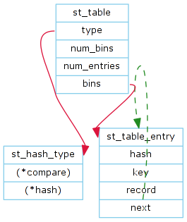

对上图进行circor布局重绘

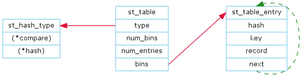

节点式的hash表实例

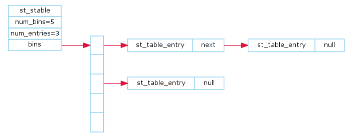

软件模块组成图

-   Apache httpd模块关系

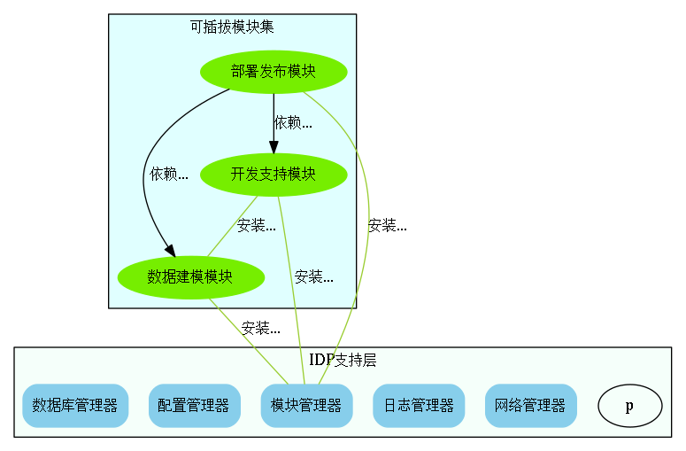

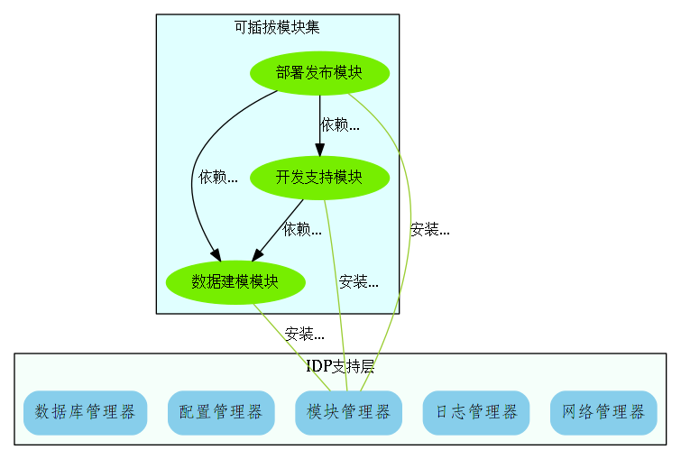

状态机

1.  有限自动机示意图

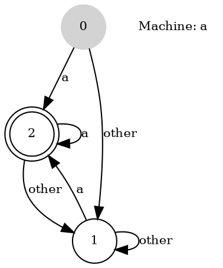

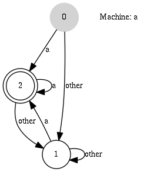

OSGI中模块的生命周期图

抽象语法树

简单的UML类图

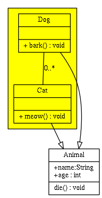

状态图

时序图

