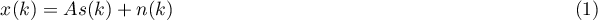
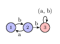
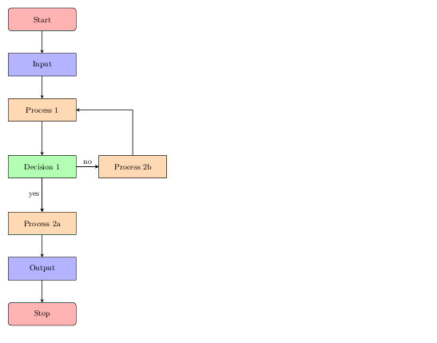

# Org-mode技巧之Latex导出

&ensp;&ensp; Emacs的 `Org-mode` 是一个强大的写作工具，与 `Markdown` 相比， `Org-mode` 的功能更为强大，但是同时它的学习成本相对来说要高一些。 `Org-mode` 中有许多很方便的 小技巧，这篇博文主要是用来记载和总结使用过程发现的技巧， 以便以后忘了可以查找。并会一直更新。


## `Latex` 公式导出

&ensp;&ensp; `Org-mode` 对 `Latex` 支持很好，可以直接通过 `\begin{}-\end{}` 方式嵌入 `Latex` 代码，但是在 `Org-mode` 中导出为 `Markdown` 后， `Latex` 并不会进行转换。 这里就稍微进行下设置。 比如:

```latex
\begin{equation}
x(k) = As(k)+n(k)
\end{equation}
```

会输出为:

`\begin{equation}x(k) = As(k)+n(k)\end{equation}`

&ensp;&ensp; 这时你只需要添加一行配置， 让 `Emacs` 将 `Latex` 转换成图片， 然后在导出 `Markdown` 中显示。 这里你可以选择 `Emacs` 内置的 `dvipng` 或者 `imagemagick` (需要安装)来进行图片转换。 其中 `divpng` 只能转换成 `png` 图片格式, 而 `imagemagick` 可以转换成多种图片格式。

-   如果你采用 `divpng` 的话:

需要在代码上方或者文档顶部添加 `#+OPTIONS: tex:dvipng` , 比如:

```latex
#+OPTIONS :tex:dvipng
\begin{equation}
x(k) = As(k)+n(k)
\end{equation}
```

&ensp;&ensp; 导出的 `Markdown` 中会显示为:


<div class="figure">
<p></p>
</div>

-   如果你使用 `imagemagick` 的话

需要在代码上方或者文档顶部添加 `#+OPTIONS: tex:iamgemagick` , 比如:

```latex
#+OPTIONS: tex:imagemagick
\begin{equation}
x(k) = As(k)+n(k)
\end{equation}
```

&ensp;&ensp; 导出的 `Markdown` 中会显示为:


<div class="figure">
<p></p>
</div>


## `Latex` 绘图导出

&ensp;&ensp; Latex是一门强大的脚本语言，它不仅可以生成公式，我们还可以使用它的tikz宏包来画图。上面的方法只能将公式导出为图片，而不能将Latex绘图转换成图片 .想要将Latex中的图片导出为图片，还需要对emacs做如下操作：


### 安装imagemagick

&ensp;&ensp;org-mode导出图片默认使用imagemagick来将.tex文件转换为图片，所以首先确保你的电脑里面装了imagemagick.

[imagemagick(下载地址)](http://www.imagemagick.org/script/download.php)


### 安装ghostscript

&ensp;&ensp;ghostscript是一个postscript和pdf的解释器。org-mode导出Latex图片的时候默认会先将.tex文件生成pdf文件，然后调用第三方的转换工具（如imagemagick）将pdf文件转换成图片文件,所以需要 下载ghostscript的支持。

[ghostscript(下载地址)](https://www.ghostscript.com/download/)


### .emacs中配置(windows,Linux不需要)

&ensp;&ensp;org-mode中默认采用的是 `convert` 命令来对 `pdf->图片` 的转换，但是windows中的imagemagick的工具中进行图片转换采用的命令是 `magick` （Linux下采用的是 `convert` 所以不需要设置这一步）, 这就需要修改org-mode的转换函数。在 `emacs.d/elpha/org-20170210/ob-latex.el` 文件中查看:

```elisp
(defun org-babel-latex-convert-pdf (pdffile out-file im-in-options im-out-options)
  "Generate a file from a pdf file using imagemagick."
  (let ((cmd (concat "convert " im-in-options " " pdffile " "
		     im-out-options " " out-file)))
    (message "Converting pdffile file %s..." cmd)
    (shell-command cmd)))
```

&ensp;&ensp; 在 `.emacs` 中对上面函数进行复写.

```elisp
(eval-after-load "ob-latex"
(defun org-babel-latex-convert-pdf (pdffile out-file im-in-options im-out-options)
  "Generate a file from a pdf file using imagemagick."
  (let ((cmd (concat "magick " im-in-options " " pdffile " "
		     im-out-options " " out-file)))
    (message "Converting pdffile file %s..." cmd)
    (shell-command cmd)))
)
```

`Note:` 可能因为平台或者org版本不同，路径和函数名会不太一样。


### org-mode导出设置

&ensp;&ensp; org-mode默认导出 `Latex` 不会导出文件。需要对 `export` 进行一下设置:

```org
#+header: :imagemagick yes
#+begin_src latex :export code :file images/example.png :packages '(("" "tikz")) :border 1em :results value raw 
  % Define block styles
  \usetikzlibrary{shapes,arrows}
  \tikzstyle{astate} = [circle, draw, text centered, font=\footnotesize, fill=blue!25]
  \tikzstyle{rstate} = [circle, draw, text centered, font=\footnotesize, fill=red!25]

  \begin{tikzpicture}[->,>=stealth', shorten >=1pt, auto, node distance=2.8cm, semithick]
    \node [astate] (1) at (0,0) {1};
    \node [astate] (2) at (1,0) {2};
    \node [rstate] (3) at (2,0) {3};
    \path (1) edge [bend left] node {b} (2)
	  (2) edge node {b} (3)
	  (2) edge [bend left] node {a} (1)
	  (3) edge [loop above] node {(a, b)} (3);
  \end{tikzpicture}
#+end_src
```



&ensp;&ensp; 再比如利用Latex的tikz包画的一个流程图

```org
#+header: :imagemagick yes
#+begin_src latex :export code :file images/example2.png :packages '(("" "tikz")) :border 1em :results value raw 
%\documentclass[UTF8]{ctexart}
%\usepackage{tikz,mathpazo}
%\usetikzlibrary{shapes.geometric, arrows}
\begin{document}
\thispagestyle{empty}
 % 流程图定义基本形状
\tikzstyle{startstop} = [rectangle, rounded corners, minimum width=3cm, minimum height=1cm,text centered, draw=black, fill=red!30]
\tikzstyle{io} = [trapezium, trapezium left angle=70, trapezium right angle=110, minimum width=3cm, minimum height=1cm, text centered, draw=black, fill=blue!30]
\tikzstyle{process} = [rectangle, minimum width=3cm, minimum height=1cm, text centered, draw=black, fill=orange!30]
\tikzstyle{decision} = [diamond, minimum width=3cm, minimum height=1cm, text centered, draw=black, fill=green!30]
\tikzstyle{arrow} = [thick,->,>=stealth]

\begin{tikzpicture}[node distance=2cm]
 %定义流程图具体形状
\node (start) [startstop] {Start};
\node (in1) [io, below of=start] {Input};
\node (pro1) [process, below of=in1] {Process 1};
\node (dec1) [decision, below of=pro1, yshift=-0.5cm] {Decision 1};
\node (pro2a) [process, below of=dec1, yshift=-0.5cm] {Process 2a};
\node (pro2b) [process, right of=dec1, xshift=2cm] {Process 2b};
\node (out1) [io, below of=pro2a] {Output};
\node (stop) [startstop, below of=out1] {Stop};

 %连接具体形状
\draw [arrow](start) -- (in1);
\draw [arrow](in1) -- (pro1);
\draw [arrow](pro1) -- (dec1);
\draw [arrow](dec1) -- (pro2a);
\draw [arrow](dec1) -- (pro2b);
\draw [arrow](dec1) -- node[anchor=east] {yes} (pro2a);
\draw [arrow](dec1) -- node[anchor=south] {no} (pro2b);
\draw [arrow](pro2b) |- (pro1);
\draw [arrow](pro2a) -- (out1);
\draw [arrow](out1) -- (stop);
\end{tikzpicture}
\end{document}
#+end_src
```



> Everything should be made as simple as possible, but not any simpler &#x2013; Albert Einstein

**如果觉得本文有什么地方不对，或者不妥的地方，欢迎在下方评论斧正。**
