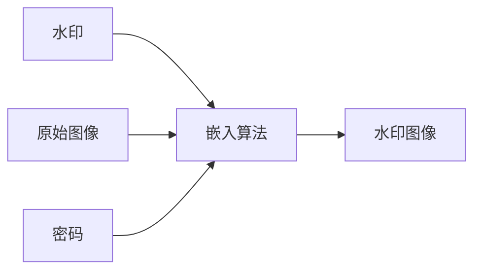
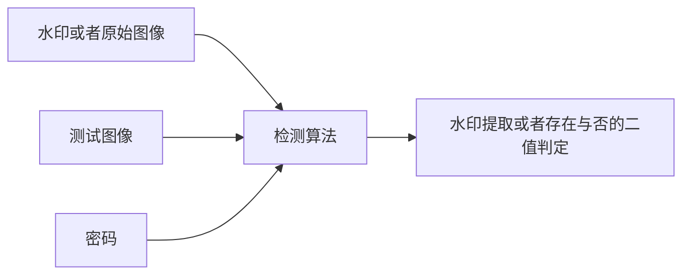

#### 
日报

##### 
今日计划
 

+ 了解傅里叶算法的实现 

##### 
今日成果
 

+ 填补了图像处理的一些基本概念
+ 查资料解决了昨天的几个困惑
+ 初步了解了下傅里叶变换和傅里叶级数

#### 
今日随记+接昨日

&ensp;&ensp;&ensp;&ensp;数字盲水印是数字防伪追踪的一种方式，主要应用于图像领域。其实数字盲水印是数字水印的一种，属于信息隐藏领域。数字盲水印实质上是将相关敏感信息隐藏到图片当中，让用户无法从图片中判别敏感信息是否存在，并且难以获得敏感信息。 关于信息隐藏的特点:

1. 鲁棒性，也就是抗破坏性, 指不因图像文件的某种改动而导致隐藏的敏感信息丢失的能力，这里的改动指的是对传输过程中的信道噪音、滤波操作、重采样、有损编码亚索（如jpg）、D/A或A/D转换等
2. 不可检测性 , 也就是和原始图片的一致特性，如具有一致的噪音分布，从而使非法拦截这无法判断是否有隐蔽的敏感信息
3. 透明性，这个很简单，不能让用户从肉眼看到隐藏的敏感信息
4. 安全性，指隐藏算法具有很强的抗攻击能力，让它能够承受一定程度的人为攻击而不破坏隐藏的敏感信息
5. 自恢复性，使图片经过一些操作或者变换之后，仍然能从留下的片段数据中恢复隐藏数据，例如，用户剪切一半的图片，我们仍然能从剪切中的图片中获得隐藏敏感信息。

##### 
基本概念的说明 
 
   
+ 空域  &ensp;&ensp;&ensp;&ensp;图像的空域就是我们平常所见的图像。
+ 频域  &ensp;&ensp;&ensp;&ensp;图像的频率指的是图像中灰度变化剧烈的程度。如果图像的灰度变化快的话就是说图片的频率高，如果图像的灰度变化慢的话说明图片的频率低。
+ 噪声  &ensp;&ensp;&ensp;&ensp;图像中的噪声是，在图像拍摄和传输过程中的给给最终生成的图像质量造成的影响的因素.

##### 
典型数字水印的系统模型 

##### 
关于数字盲水印的实现的几种方法。 

+ 空域算法实现
  &ensp;&ensp;&ensp;&ensp; 这种算法就是将信息嵌入到随机选择的图像中的不重要的像素点中,这样可以保证不重要的像素位。这样能够保证水印是不可见的，但是由于使用了不重要的像素点，用户可能通过对图片进行操作,比如滤波，变形，图像量化的操作从而能在不破坏图像的整体质量的基础上进行破坏水印, 鲁棒性差,patchwork比较典型的空域实现算法。但是该算法实现相对于简单。对鲁棒性要求不高的可以考虑这种方法实现。

+ 变换域+扩展频谱算法实现(关于知乎中的讨论的支付宝如何通过截屏来找到刷月饼的员工的最高支持贴就是用的这种算法)
 &ensp;&ensp;&ensp;&ensp;这种方法简单的来说，将图像进行一系列的变化,也利用下面的扩展频谱通信算法, 将图像的空域信息通过一系列的数学变化转换为频率信息，就是将水印从不重要像素位转移到图像的低频段，从而提高空域算法的鲁棒性的特点，但是该算法，复杂度高，需要进行多种数学变化。

+ 压缩域算法
+ NEC算法
+ 生理模型算法

##### 
为什么在频域添加的水印比在空域添加的水印的隐蔽性更好，鲁棒性更高? 

&ensp;&ensp;&ensp;&ensp;首先从空域和频域的概念来说，空域就是我们日常所见的图像或者图像的差分所组成的，所以在空域添加水印的话，会直接增加图像的噪声，如果增加的信息过多的话，会影响图片的质量, 所以这也是为什么空域添加的信息比较少的原因，因为你只能在不影响图片质量的基础上去添加水印。同时，在空域上添加水印，被发现的可能性更高，毕竟它没有经过数学转换，我们也可以将数学转换，也就是从空域到频域的过程中看做一个编码过程(加密),编过码(加过密)总归要更加难以被发现。那为什么鲁棒性更高呢？这很好理解，我们修改图像的时候比如剪切，涂抹,压缩什么的都是直接对图像的空域操作，而对图像的灰度影响比较少。而且你不知道水印加在哪个频段，而且收到攻击，往往会破坏图像原本内容。

##### 
为什么说生成的水印图像的隐蔽性和鲁棒性是互斥的呢？ 

&ensp;&ensp;&ensp;&ensp;首先隐蔽性，也就是不可见性，它是指隐蔽载体与原始载体具有一致的性特性，比如说具有一致的统计噪声分布，从而使第三方的非法拦截者无法判断是否有隐蔽信息.也就是说水印图像中的水印与图像的一致性.而鲁棒性是指不因图像的某种改动而导致水印信息的丢失的能力。然而如果水印的隐蔽性越高，也就是它和图像的一致性越高，那么对图像进行改动操作，造成水印信息丢失的可能性就越高。两者呈负相关。

##### 
明日计划 

+ 研究傅里叶变换在频域添加水印的具体实现

##### 
可不可以申请不和破晓项目组的时间同步，每天这样眼睛有点受不了，同时现在也没有很多事，而且晚上的工作效率也很低

