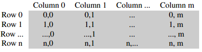
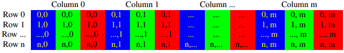

#### <div style="color:#369">日报</div>


##### <div style="color:#369">今日计划</div> 

+ 完成C++程序的编写


##### <div style="color:#369">今日随记</div> 

###### <div style="color:#369">OpenCV Mat数据类型详解 </div>
&ensp;&ensp;&ensp;&ensp;Mat是OpenCV最基本的数据结构，OpenCV将从文件读取的图像和视频信息一般都存在Mat数据结构中，显然Mat是(Matrics 矩阵)的缩写。OpenCV的Mat跟Matlab中的矩阵类型很像, 但是又有一些区别。总的来说，对于矩阵的操作，两者是很相似的但是，数据存储方面还是有些不同。

Mat数据结构主要是包含2部分: Header 和 Pointer。 Header中主要包含矩阵大小， 存储方式， 存储地址等信息; Pointer中存储指向像素值的指针。

```cpp
    enum { MAGIC_VAL  = 0x42FF0000, AUTO_STEP = 0, CONTINUOUS_FLAG = CV_MAT_CONT_FLAG, SUBMATRIX_FLAG = CV_SUBMAT_FLAG };
    enum { MAGIC_MASK = 0xFFFF0000, TYPE_MASK = 0x00000FFF, DEPTH_MASK = 7 };

    /*! includes several bit-fields:
         - the magic signature
         - continuity flag
         - depth
         - number of channels
     */
    int flags;
    //! the matrix dimensionality, >= 2
    int dims;
    //! the number of rows and columns or (-1, -1) when the matrix has more than 2 dimensions
    int rows, cols;
    //! pointer to the data
    uchar* data;

    //! helper fields used in locateROI and adjustROI
    const uchar* datastart;
    const uchar* dataend;
    const uchar* datalimit;

    //! custom allocator
    MatAllocator* allocator;
    //! and the standard allocator
    static MatAllocator* getStdAllocator();
    static MatAllocator* getDefaultAllocator();
    static void setDefaultAllocator(MatAllocator* allocator);

    //! interaction with UMat
    UMatData* u;

    MatSize size;
    MatStep step;
```


&ensp;&ensp;&ensp;&ensp;Mat常用来存储图像，一般来说Mat存储图像分为两种，一种是单通道二维数组和多通道二维数组， 其中单通道二维数组用来存储灰度图，多通道二位数组存储彩色图

**单通道二维数组的存储结构**



**多通道二位数组的存储结构**



###### <div style="color:#369">OpenCV Mat的基本操作</div>

**构造一个Mat**

&ensp;&ensp;&ensp;&ensp;openvc中构建一个Mat数据有很多方法，你可以通过读取文件来构造一个Mat数据，通常是图片文件，你也可以通过自己定义数据来构建一个Mat数据

*通过读取文件构造一个Mat数据结构*

```cpp
    Mat M = imread("./water.jpg");
```

*通过自定义数据来构建一个Mat数据*

&ensp;&ensp;&ensp;&ensp; 通过自定义数据来构造一个Mat数据结构有很多方法，这里只是把常用的几种方法列出来，具体可以去看<span style="color:#c7254e;background-color:#f9f2f4;border:1px solid #f9f2f4; margin-left: 10px; margin-right: 10px; border-radius:6px;">`mat.hpp`</span>文件中Mat类的构造函数

&ensp;&ensp;&ensp;&ensp;1.&ensp;&ensp;通过`Mat(int rows, int cols, int type, const Scalar& s)`;其中Scalar是一个待填充进去的标量

```cpp
    
    //构建一个3x2的4通道8位矩阵, 每个元素值为(1, 2, 3, 4)
    Mat M(3, 2, CV_8UC4, Scalar(1, 2 ,3, 4));
    cout « M « endl;

```

```shell
[  1,   2,   3,   4,   1,   2,   3,   4;
1,   2,   3,   4,   1,   2,   3,   4;]
```

&ensp;&ensp;&ensp;&ensp;2.&ensp;&ensp;通过`Mat(Size const &, int type)`构建一个Mat


```cpp
   //构建一个3x3的默认单通道矩阵，元素默认为0
   Mat M(Size(3,3), CV_8U);
   cout « M « endl;

```

```shell

[0,   0,   0;
 0,   0,   0;
 0,   0,   0]
 
```

###### <div style="color:#369">8位和32位图片的区别 </div>

&ensp;&ensp;&ensp;&ensp;通常图像使用无符号8位的格式来表示，这种格式可以兼容现在众多的图像库。opencv也只支持8位无符号的格式，如果图片被转成32位，那么opencv中的imshow函数无法正常显示图片，一般opencv会将所有非0的值转成1，随意32位的图片通常显示为白色图片

##### <div style="color:#369">今日成果</div> 


#### 明日计划

+ 完成C++程序的编写


