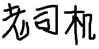

#### <div style="color:#369"> 日报 </div> 


##### <div style="color:#369"> 今日计划 </div>

+ 尝试用水印从加了水印的图片解出原图


##### <div style="color:#369"> 今日随记 </div>

+ 利用水印从加了水印的图片中分离原图的可行性分析 

&ensp;&ensp;&ensp;&ensp; 这种方法从理论上是不可行的，因为本来利用频域进行水印叠加，本来就是利用了频域的相关变化对空域的变化的影响特别小的特点。所以, 不管是用水印从加了水印的图片, 或者是没有加了水印的图片，分离原图时，用加了水印的图片的频域和原水印的频域作差，得到的图片两者没有肉眼可见的区别，无法辨识。


*测试代码*

```cpp
#include <opencv2/opencv.hpp>
#include <iostream>

using namespace std;
using namespace cv;

string getImgType (cv::Mat frame)
{
    int imgTypeInt = frame.type();
    int numImgTypes = 28; // 7 base types, with 4 channels options each 

    int enum_ints[] =  {
        CV_8UC1, CV_8UC2, CV_8UC3, CV_8UC4, CV_8SC1, CV_8SC2, CV_8SC3, CV_8SC4, CV_16UC1, CV_16UC2, CV_16UC3, CV_16UC4, CV_16SC1, CV_16SC2, CV_16SC3, CV_16SC4, CV_32SC1, CV_32SC2, CV_32SC3, CV_32SC4, CV_32FC1, CV_32FC2, CV_32FC3, CV_32FC4,  CV_64FC1, CV_64FC2, CV_64FC3, CV_64FC4 
    };

    string enum_string[] = {
        "CV_8UC1,", "CV_8UC2,","CV_8UC3,", "CV_8UC4,", "CV_8SC1,", "CV_8SC2,", "CV_8SC3,", "CV_8SC4,", "CV_16UC1", "CV_16UC2", "CV_16UC3", "CV_16UC4", "CV_16SC1", "CV_16SC2", "CV_16SC3", "CV_16SC4", "CV_32SC1", "CV_32SC2", "CV_32SC3", "CV_32SC4", "CV_32FC1", "CV_32FC2", "CV_32FC3", "CV_32FC4",  "CV_64FC1", "CV_64FC2", "CV_64FC3", "CV_64FC4"};

    for (int i = 0; i< numImgTypes; i++) 
    {
        if (imgTypeInt == enum_ints[i]) 
            return enum_string[i];

    }
    return "unknown image type";

};


Mat dofft(Mat const &src){

    Mat padded;
    int m = getOptimalDFTSize(src.rows);
    int n = getOptimalDFTSize(src.cols);

    copyMakeBorder(src, padded, 0 , m-src.rows, 0,  n-src.cols, BORDER_CONSTANT, Scalar::all(0));

    Mat fImage;

    padded.convertTo(fImage, CV_32F);

    Mat planes[] = { fImage, Mat::zeros(padded.size(), CV_32F) };


    Mat complexI;
    merge(planes, 2, complexI);

    //cout << complexI<<endl;

    dft(complexI, complexI, DFT_SCALE | DFT_COMPLEX_OUTPUT);

    split(complexI, planes);

    //cout <<  "complexI" << complexI.cols << endl;
    //cout <<  "complexI" <<  complexI.rows << endl;
    return complexI;
}

int showSpectrumImg(Mat const &orgspectrumMat) {

    Mat spectrumMat;
    orgspectrumMat.copyTo(spectrumMat);

    if (spectrumMat.empty())

        return -1;
    vector<Mat> planes;
    Mat dst;


    split(spectrumMat, planes);
    magnitude(planes[0], planes[1], planes[0]);
    dst = planes[0];
    dst += Scalar::all(1);

    dst = dst(Rect(0,0,dst.cols & -2, dst.rows & -2));
    log(dst, dst);


    Mat finalSpectrum;
    normalize(dst, finalSpectrum, 0, 1, CV_MINMAX);
    imshow("频谱图", finalSpectrum);
    waitKey(0);
    return 0;
}

vector<Mat> MultiChannelDFT( Mat const &src ) {

    
    Mat tmpMat, dst;
    src.copyTo(tmpMat);

    vector<Mat> planes;
    vector <Mat> results;
    if (src.channels() > 1) {

        split(tmpMat, planes);
        vector<Mat>::iterator iter;

        for (iter = planes.begin(); iter!= planes.end(); iter++) {
            Mat tmp ;
            tmp = *iter;
            results.push_back(dofft(*iter));
        }
    }


    return results; 


}

Mat MultiChannelIDFT (vector<Mat> src){

    Mat dst,tmpMat;

    vector<Mat>::iterator iter;
    vector<Mat> results;

    for (iter=src.begin(); iter!= src.end(); iter++) {
            Mat tmp;
            idft(*iter, tmp, DFT_INVERSE | DFT_REAL_OUTPUT);
            results.push_back(tmp);
        }
    merge(results, dst);
    return dst;
}

vector<Mat> SubtractSpectrum( vector<Mat> & srcImg,vector<Mat>  & watermark ) {
     
    vector<Mat> tmpImg(srcImg.size()) ;
    copy(srcImg.begin(), srcImg.end(), tmpImg.begin());

    cout << tmpImg.size() << endl;
    cout << watermark.size() << endl;

    vector<int>::size_type i;
    vector<int>::size_type j;

    for (i = 0, j = 0; i < tmpImg.size() && j< watermark.size(); i++, j++ ) {

        vector<Mat> tcomplex;
        vector<Mat> wcomplex;


        split(tmpImg.at(i),tcomplex);
        split(watermark.at(j),wcomplex);
        //cout << tmpImg.at(i) << endl;
        //cout << tmpImg.at(i).channels() << endl;
        //cout << i << endl;
        //split(tmpImg.at(i), tcomplex);

        int col1,col2,row1,row2;
        
        //cout << tcomplex[0].cols << endl;
        //cout << tcomplex[0].rows << endl;

        //exit(0);

        for (row1 = 0,row2 = 0; row1 < tmpImg.at(i).rows && row2 < watermark.at(j).rows; row1++,row2++ ) {
            for (col1 = 0, col2 = 0; col1 < tmpImg.at(i).cols && col2 < watermark.at(j).cols;col1++,col2++) {
               cout << "未减的原图频域点的实数值" << tcomplex[0].at<double>(row1, col1) << endl;
               cout << "未减的水印频域点的实数值" << wcomplex[0].at<double>(row1, col1) << endl;
               tcomplex[0].at<double>(row1, col1) -= wcomplex[0].at<double>(row2,col2);
               cout << "减后的频域点的实数值" << tcomplex[0].at<double>(row1, col1) << endl;
               //cout << "未添加的原图频域点的虚数值" << tcomplex[1].at<double>(row1, col1) << endl;
               //cout << "未添加的水印频域点的虚数值" << wcomplex[1].at<double>(row1, col1) << endl;
               tcomplex[1].at<double>(row1, col1) -= wcomplex[1].at<double>(row2,col2);
               //cout << "添加后的频域点的虚数值" << tcomplex[1].at<double>(row1, col1) << endl;

            }
        }
    } 
    return tmpImg;
}


vector<Mat> OverlaySpectrum( vector<Mat> & srcImg,vector<Mat>  & watermark ) {
     
    vector<Mat> tmpImg(srcImg.size()) ;

    copy(srcImg.begin(), srcImg.end(), tmpImg.begin());


    vector<int>::size_type i;
    vector<int>::size_type j;

    for (i = 0, j = 0; i < tmpImg.size() && j< watermark.size(); i++, j++ ) {

        vector<Mat> tcomplex;
        vector<Mat> wcomplex;

        split(tmpImg.at(i),tcomplex);
        split(watermark.at(j),wcomplex);
        //cout << tmpImg.at(i) << endl;
        //cout << tmpImg.at(i).channels() << endl;
        //cout << i << endl;
        //split(tmpImg.at(i), tcomplex);

        int col1,col2,row1,row2;
        
        //cout << tcomplex[0].cols << endl;
        //cout << tcomplex[0].rows << endl;

        //exit(0);

        for (row1 = 0,row2 = 0; row1 < tmpImg.at(i).rows && row2 < watermark.at(j).rows; row1++,row2++ ) {
            for (col1 = 0, col2 = 0; col1 < tmpImg.at(i).cols && col2 < watermark.at(j).cols;col1++,col2++) {
               //cout << "未添加的原图频域点的实数值" << tcomplex[0].at<double>(row1, col1) << endl;
               //cout << "未添加的水印频域点的实数值" << wcomplex[0].at<double>(row1, col1) << endl;
               tcomplex[0].at<double>(row1, col1) += wcomplex[0].at<double>(row2,col2);
               //cout << "添加后的频域点的实数值" << tcomplex[0].at<double>(row1, col1) << endl;
               //cout << "未添加的原图频域点的虚数值" << tcomplex[1].at<double>(row1, col1) << endl;
               //cout << "未添加的水印频域点的虚数值" << wcomplex[1].at<double>(row1, col1) << endl;
               tcomplex[1].at<double>(row1, col1) += wcomplex[1].at<double>(row2,col2);
               //cout << "添加后的频域点的虚数值" << tcomplex[1].at<double>(row1, col1) << endl;

            }
        }
    }
    
    return tmpImg;
}


vector<Mat> WmSplit( Mat & waterImg,Mat & watermark) {

    Mat orgImg;
    vector<Mat> tmpImg;
    vector<Mat> subspec;


    vector<Mat> waterImgSpec = MultiChannelDFT(waterImg);
    vector<Mat> watermarkSpec= MultiChannelDFT(watermark);
    subspec =  SubtractSpectrum(waterImgSpec, watermarkSpec);
    cout << subspec.size() << endl;
    cout << subspec.at(0).channels() << endl;
    orgImg = MultiChannelIDFT(subspec);

    orgImg.convertTo(orgImg, CV_8U);

    imshow("水印图", watermark);
    imshow("解出后的原图", orgImg);
    waitKey(0);
    tmpImg.push_back(orgImg);

    tmpImg.push_back(watermark);
    return tmpImg;


}


int main() {

    Mat I = imread("water.jpg",CV_LOAD_IMAGE_COLOR);
    Mat W = imread("laosiji.jpg", CV_LOAD_IMAGE_UNCHANGED);
    Mat Icopy;

    I.copyTo(Icopy);
    //cout << W.channels() << endl;
    //cout << getImgType(W) << endl;
    //cout << W.size() << endl;
    //imshow("原图", I);
    //imshow("水印图", W);
    //waitKey(0);

    //加水印
    vector<Mat> fourierTransform;
    vector<Mat> WfourierTransfrom;
    vector<Mat> WaterImgF;

    fourierTransform = MultiChannelDFT(I);
    WfourierTransfrom = MultiChannelDFT(W);

    WaterImgF = OverlaySpectrum(fourierTransform, WfourierTransfrom);
    /*showSpectrumImg(WaterImgF);*/
    //显示频域图
    //showSpectrumImg(fourierTransform);

    //IFFT
    cout << "Inverse transform"<<endl;
    Mat inverseTransform;
   //Back to 8-bits
    Mat finalImage;
    inverseTransform = MultiChannelIDFT(WaterImgF);
    inverseTransform.convertTo(finalImage, CV_8U);
    imshow("经转换过的图片", finalImage);
    waitKey();

    //利用水印原图进行解水印
    //使用加水印的原图进行解水印
    WmSplit(finalImage, W);
    //使用未加水印的原图解水印
    WmSplit(Icopy, W);
}
```

*相关结果图片呈现*

**原图**


**水印图片**



**加了水印的图片**


**从加了水印的图片中解出的图片**


**从未加了水印的图片中解出的图片**


##### <div style="color:#369">显然从上面的结果显示，此方法无法用来辨识加了水印的图片和未加了水印的图片 </div>


##### <div style="color:#369"> 今日成果 </div>

+ 测试了用水印从加了水印的图片解出原图的可用性

##### <div style="color:#369">明日计划 </div>

+ 研究盲源分离进行解水印

