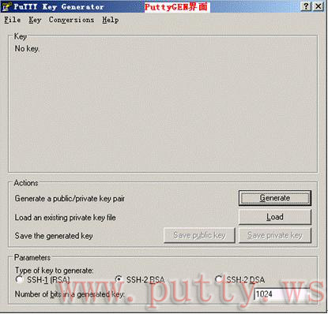
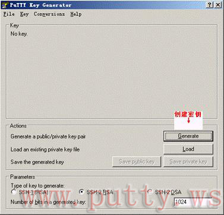
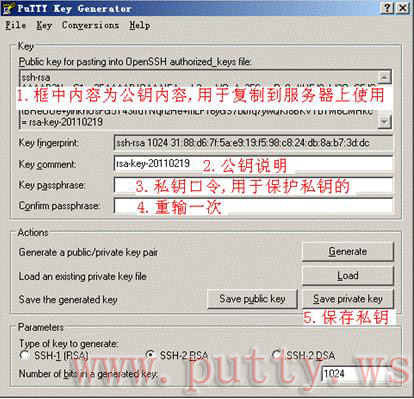
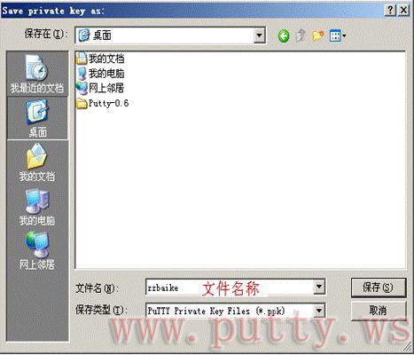

##### Gentoo安装ssh服务端
  

###### 查看系统是否已经安装了openssh
  Gentoo一般都内置了openssh-server, 如果你想确认一下你装的gentoo中到底是否内置了ssh服务端的话，你可以执行
    
  ```shell
    ssh
  ```

  如果你收到一下提示:

  ```
  ➜  Linux (master) ✗ ssh

  usage: ssh [-1246AaCfGgKkMNnqsTtVvXxYy] [-b bind_address] [-c cipher_spec]
  [-D [bind_address:]port] [-E log_file] [-e escape_char]
  [-F configfile] [-I pkcs11] [-i identity_file] [-L address]
  [-l login_name] [-m mac_spec] [-O ctl_cmd] [-o option] [-p port]
  [-Q query_option] [-R address] [-S ctl_path] [-W host:port]
  [-w local_tun[:remote_tun]] [user@]hostname [command]

  ``` 
  说明你的Gentoo中已经内置了openssh了


  或者进行进一步确认执行:

  ```shell
    emerge --search openssh
  ```

  查看结果是否有net-misc/openssh这个软件包,有就说明你的电脑内置了,没有就说明你还得装


###### 安装openssh (可选)

  如果你通过上述步骤发现你电脑里没有openssh,那么你就要进行安装,在命令行中执行:

  ```
    emerge  --ask  net-misc/openssh

  ```
  进行安装


###### 配置root允许密码登陆(不推荐)
  openssh默认下为了安全考虑是不予许远程用户用root账户和密码登陆的,如果你想要开启root和密码登陆的话，就需要对ssh进行配置, ssh默认的配置文件是`/etc/ssh/sshd_config`.
  为了开启这种功能，你需要将`PermitRootLogin  prohibit-password`选项改为`PermitRootLogin yes`
  
```
  SyslogFacility AUTH
  LogLevel INFO

  # Authentication:
  LoginGraceTime 120
  # PermitRootLogin prohibit-password
  PermitRootLogin yes
  StrictModes yes

  RSAAuthentication yes
  PubkeyAuthentication yes
  #AuthorizedKeysFile     %h/.ssh/authorized_keys

```
 不过不推荐这种方式登陆，不安全, 建议使用ssh证书登陆


###### 配置ssh证书登陆
  
      ssh证书登陆，就是通过 用相关工具生成一对公钥和私钥，服务端生成持有公钥进行对客户段持有私钥的验证,验证通过认为是合法的，允许登陆

　　所以配置ssh证书登陆大概分为这几个步骤: 
     + 生成对应的密钥对 
     + 将公钥放入服务器的`~/.ssh/authorized-keys`文件中
     + 使用私钥连接服务器
  
  + **生成对应的密钥对**
   
  *Windows*

  > Windows下可以使用putty套件中的[puttygen](https://the.earth.li/~sgtatham/putty/latest/x86/puttygen.exe)来生成密钥对
  > Puttygen 是一个可以产生秘钥的工具,它通过借用鼠标的移动产生的随机数据生成RSA或DSA秘钥,用于Putty,Plink,PSFP,PSCP和Pageant


  1. **下载工具**

  
  2. **打开puttygen.exe**

  

  3. **点击Generate创建新的秘钥**

  

  4. **鼠标在空白处移动，产生更多的随机数据,方便生成密钥匙**

  
  
  5. **复制生成的公钥,并将其保存起来**

  
   
  *Note: 公钥将会保存到你需要登陆的服务器*

  6. **选择是否设置私钥密码**

  >　如果你设置私钥密码的话，那么你用证书登陆的时候将要输入私钥密码才能进行登陆，如果你不设置私钥密码那么你可以直接免密登陆
  

  


  7. **保存私钥**

  > 将私钥保存为文件

  


  

  *Linux*

  + **将公钥放入服务器中**
  + **使用私钥连接服务器**


  **Notice**: 如果要让root用户只能使用秘钥登陆而不能使用密码登陆，需要在/etc/ssh/sshd_config中同时设置: 

  ```
    PermitRootLogin prohibit 
    PasswordAuthentication no

  ```
