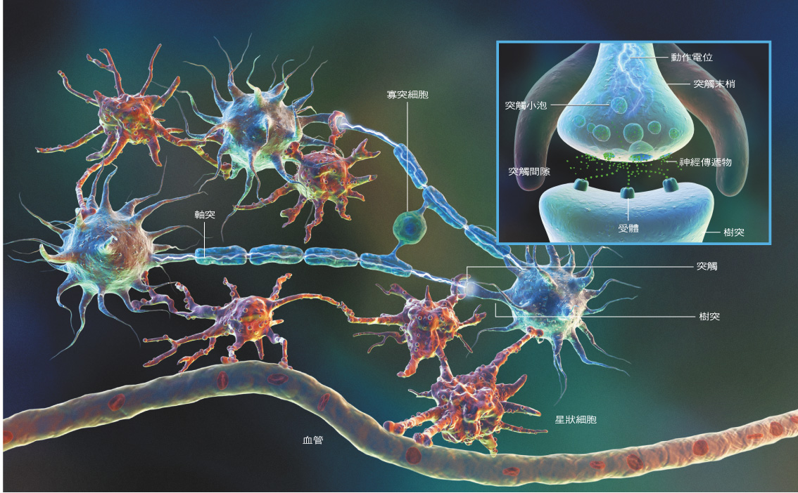
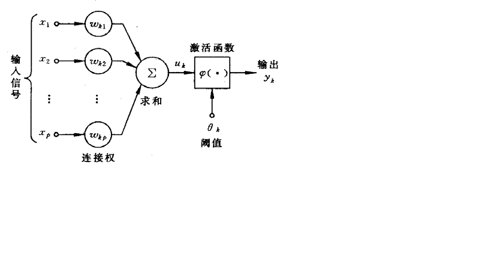

##### 目录
<!-- MarkdownTOC -->

- 人工神经网络的相关介绍
- BP神经网络算法的相关介绍
- 神经网络的基本原理
- 参考资料

<!-- /MarkdownTOC -->

# 人工神经网络的相关介绍 

> 人工神经网络是在现代神经科学的基础上提出和展起来的，旨在反映人脑结构和功能的抽象数学模型。经典的神经网络的模型有:

>   1. 感知机
>   2. Hopfield网络
>   3. Boltzman 机
>   4. 自适应共振理论
>   5. 反向传播网络(BP)

 
# BP神经网络算法的相关介绍

> BP神经网络(Back Progapation Neural Network), 又称反向传播神经网络。BP神经网络是一种多层的前馈神经网络，其主要的特点是: 信号是前向传播，而误差是反向传播。

# 神经网络的基本原理

神经元图

神经元模型

   + 一组连接
   ( 
      $\color{#338DCD}{x_i(1...p)\rightarrow\omega_{kp}(1...p) \rightarrow \Sigma}$
   的这个过程
   )=>生物神经元突触

# 参考资料
  
  + [http://blog.csdn.net/google19890102/article/details/32723459](http://blog.csdn.net/google19890102/article/details/32723459)
