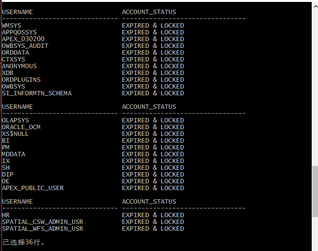
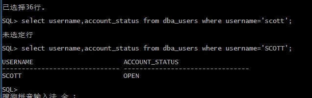

#### <center><strong>Oracle数据库系列- 开场篇</strong></center>

> Oracle数据库是数据库系统中的佼佼者，其完整性、安全性、和一致性等优点深受广大企业的青睐。Oracle数据库继承了无数多的功能，为开发者提供和不少的便利的特性。但是由于Oracle数据库庞大而繁杂的功能，导致学习Oracle数据库的难度上升不少，也同时让许多的开发者望而止步。

---

> 这一系列博客记录我在学习Oracle数据库过程中的一些心得，与大家一起分享。如果有什么不对的地方，欢迎大家在评论区进行评论指出。


**Oracle账户的解锁**

>Oracle数据库自带了许多账户，但是默认情况下Oracle数据库只对其中5个账户进行了解锁，这5个账户分别为SYS、SYSTEM、DBSNMP、SYSMAN、MGMT_VIEW，而其他用户都是默认的锁定状态。Oracle数据库的账号管理和其他关系型数据库，例如mysql,sqlserver不一样,像mysql,sqlserver数据库有专门的数据库用户管理命令对数据库用户进行管理，而Oracle数据则是直接通过sql语句通过对数据库表的操作进行对用户管理。

查看用户的账号的状态

```sql
    SELECT username, account_status from db_users;
```



    其中OPEN表示账户为解锁状态，EXPIRED表示账户为过期状态(需要设置口令才能解除此状态);LOCKED 表示账户为锁定状态。

为scott账户进行解锁
```sql
   SQL> ALTER USER scott ACCOUNT UNLOCK;
   SQL> ALTER USER scott IDENTIFIED BY tiger;
   SQL> SELECT username ,account_status FROM dba_users WHERE username = 'SCOTT';

```

    注意: 
         在使用数据字典dba_users时,需要注意其字段的值是区分大小的，所以指定username的时候需要指定为'SCOTT',而不是'scott';




