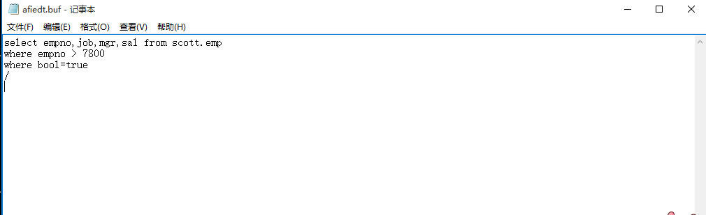
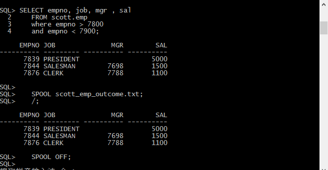
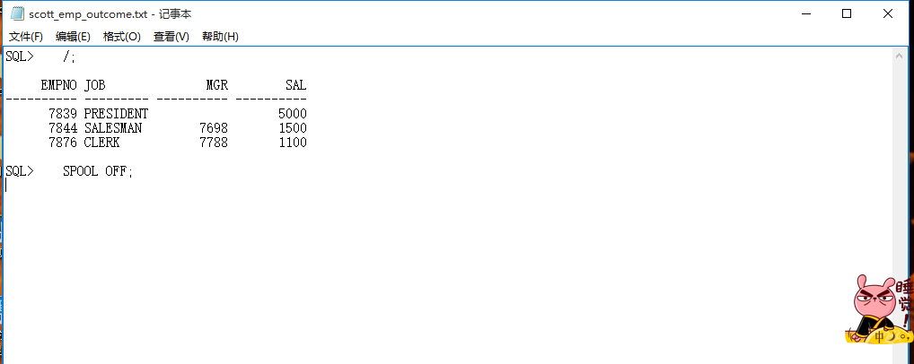

###<center><strong>Oracle数据库系列- SQL Plus SQL操作命令</strong></center>


> Oracle数据库的连接方式有很多中，你可以采用[PL/SQL]()，[Oracle SQL Developer]() 这样的工具进行数据库连接。
> 但是如果你更倾向于命令行的话，也可以用sqlplus(Oracle数据库自带的命令行工具)进行数据库SQL操作, sql plus 
> 本身就十分强大，几乎可以完成数据库操作的所有功能。

---

**<span style="color:#338DCD">连接数据库</span>**
 
 + 执行 "开始" --> "程序" -->" Oracle - OracleDb11_home1" --> "SQL Plus 命令", 输入用户名和密码进行登录

 + 在命令行中执行sqlplus命令进行连接

```
       语法: sqlplus [user_name [ /password] [ @connect_identifier ] ] [AS { SYSOPER | SYSDBA | SYSASM } / NOLOG ]; 
```       

```sql
          //以scott用户登录orcl数据库
          sqlplus scott/tiger @orcl;
```
  
 + <span style="color:#338DCD;font-size:12px">**CONNECT**</span>连接数据库

``` 

        语法:CONN[ECT] [{user_name [/password] [ @connect_identifier ] } AS　{SYSOPER | SYSDBA | SYSOPERASM } ] ]

```


```sql
       //以scott用户登录orcl数据库;
       CONNECT scott/tiger @orcl;
```

+ <span style="color:#338DCD;font-size:12px"> 
   **DISCONNECT** 
 </span> 退出数据库


```sql
      DISCONNECT;
```  


+ 退出sqlplus

```
    //退出sqlplus
    EXIT;
    //或者
    QUIT;
```


**<span style="color:#338DCD">SAVE 命令</span>**
> SQL plus命令用于将缓存区内容保存到文件
>    命令语法如下:
>       SAV[E] [FILE] file_name [CRE[ATE] | REP[LACE] | APP[END]]

> 将当前缓存区中的SQL命令保存到文件scott_emp_query.sql文件中

```sql
    SAVE scott_emp_query.sql
```


> *文件保存在当前系统路径下*


> 将当前缓存区中的SQL命令追加到文件scott_emp_query.sql文件中,如果该文件不存在，就创建该文件。

```sql
   SAVE scott_emp_query.sql APPEND;
```

> 将当前缓存区中的SQL命令替换文件scott_emp_query.sql文件中的内容,如果该文件不存在，就创建该文件。

```sql
   SAVE scott_emp_query.sql REPLACE;
```

```sql 
   SAVE scott_emp_query.sql CREATE; //创建一个scott_emp_query.sql文件并将当前缓存区中的SQL命令保存到该文件中
```

**<span style="color:#338DCD">GET 命令</span>**
> GET命令将文件中的SQL命令读取到缓存区内
  语法:
      GET [ FILE ] file_name [LIST | NOLIST]

> 将scott_emp_query.sql文件中的命令读取到缓存中并且输出显示这些内容,默认读取当前系统路径下的文件。

```sql
   GET scott_emp_query.sql List;
```


```sql
   GET　scott_emp_query.sql NOLIST; //读取文件中的内容到缓存区内但是不显示输出这些内容
```

 **<span style="color:#338DCD">START 命令</span>**
> START 命令可以读取文件中的内容到缓存区内，并运行着这些内容

     语法: STA[RT] (url | file_name)


> 将scott_emp_query.sql文件中的内容读取到缓存区中并运行。(默认读取当前系统路径下的文件)

```sql
   START scott_emp_query.sql; 
```
或者

```sql
   @scott_emp_query.sql
```
> 读取url文件并运行

```sql 
   START　http://host.domain/script.sql 
```
或者

```sql
   @http://host.domain/script.sql
```


 **<span style="color:#338DCD">EDIT 命令</span>**
> EDIT 命令可以将缓存区的内容复制到一个名为afiedt.buf的文件中，然后启动操作系统中默认的编辑器打开这个文件，并且对这个文件进行编辑。


     语法: ED[IT] (file_name)


> 打开一个记事本文件afiedt.buf,在该文件中显示缓存区中的内容，文件内容以斜杠(/)结束。 

```sql
   EDIT; 
```




> 对上述记事本中的内容可以进行编辑，在退出记事本时，所编辑的文件将被复制到缓存区内。

 **<span style="color:#338DCD">SPOOL 命令</span>**
> SPOOL 命令将命令行中的输出结果复制到一个指定的文件中。


     语法: SPO[OL] [file_name [ CRE[ATE] | REP[LACE] | APP[END] | OFF | OUT ]


> 指定文件scott_emp_outcome.txt 为结果输出文件，如果指定文件已经存在，则向该文件追加输出结果内容

```sql
   SPOOL scott_emp_coutcome.txt APPEND;
```
> 指定文件scott_emp_outcome.txt 为结果输出文件，如果指定文件已经存在，则替换该文件中的内容。

```sql
   SPOOL scott_emp_outcome.txt REPLACE; 
```
> 创建文件scott_emp_outcome.txt 为结果输出文件，

```sql
   SPOOL scott_emp_outcome.txt CREATE;
```	   

> 停止将输出结果复制到scott_emp_outcome.txt 文件中，并关闭该文件;


```sql
   SPOOL OFF;
```
> SPOOL OUT 则是启动该功能，将输出结果复制到scott_emp_out.txt文件中去;


> 指定scott_emp_outcome.txt 为结果输出文件,并将当前的缓存区中的执行结果存入scott_emp_outcome.txt文件中。

```sql
   SELECT empno, job, mgr , sal
   FROM scott.emp
   where empno > 7800
   and empno < 7900;

   SPOOL scott_emp_outcome.txt;
   /;
   SPOOL OFF;
```



